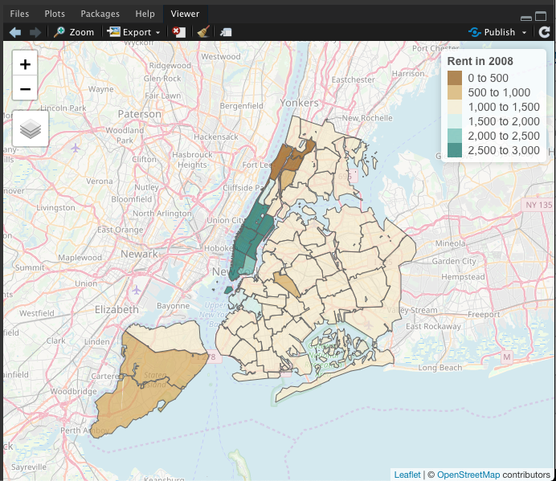

```{r setup, include=FALSE}
knitr::opts_chunk$set(echo = TRUE)
options(width=60)
```

# Introduction
```{r, echo = F}
knitr::include_graphics("plot/worldMap.pdf")
```

# Introduction
```{r, echo = F}
knitr::include_graphics("plot/threeMaps.pdf")
```

# Dealing with and visualizing spatial data in R
- Numerous spatial data formats
  - **`.shp`** (shapefile; the most common); `.geojson`, `.json`; `.gml`; `.csv`; `.tiff`...
  
- Countless packages to work with spatial data
  - Recent package **`sf`** allows geospatial data to be stored in data frames 
  - Well integrated with `tidyverse`

- Many packages to draw maps
  - **`tmap`** allows easy visualization of static and interactive maps
  - Also employs the "grammar of graphics"
  
# Overview of `tmap` package 

----------------- ---------------------- -------------------------
                      ggplot2               tmap
----------------- ---------------------- -------------------------
Data              `ggplot(...) +`         `tm_shape(...) +`

Layers            `geom_...(...) +`       `tm_...(...) +`

Small Multiples   `facet_grid(...)`       `tm_facets(...)`

Layout            `theme(...)`            `tm_layout(...)`
----------------- ---------------------- --------------------------

# Prerequisite
\small
```{r, eval = F}
install.packages(c("sf", "tmap"))
```

\small
```{r, message=F, warning=F}
# Load packages
library(tidyverse)
library(sf)
library(tmap)

# Load data (from tmap)
data(World, metro)
```

# Basics `tmap`
\scriptsize
```{r}
print(World[1,])
```

# Basics `tmap`
\scriptsize
```{r}
tm_shape(World) +
  tm_polygons() +
  tm_layout(frame = FALSE)
```

# Basics `tmap`
`tm_polygons()` is composed of two parts: `tm_borders()` and `tm_fill()`

\scriptsize
```{r}
tm_shape(World) +
  tm_borders() +
  tm_layout(frame = FALSE)
```

# Basics `tmap`
`tm_polygons()` is composed of two parts: `tm_borders()` and `tm_fill()`

\scriptsize
```{r}
tm_shape(World) +
  tm_fill() +
  tm_layout(frame = FALSE)
```

# Basics `tmap`
`tm_polygons()` is composed of two parts: `tm_borders()` and `tm_fill()`

\scriptsize
```{r}
tm_shape(World) +
  tm_borders() +
  tm_fill() +
  tm_layout(frame = FALSE)
```

# Basics `tmap`
`tm_polygons()` is composed of two parts: `tm_borders()` and `tm_fill()`

\scriptsize
```{r}
tm_shape(World) +
  tm_borders(lty = 2) +
  tm_fill() +
  tm_layout(frame = FALSE)
```

# Basics `tmap`
\scriptsize
```{r}
tm_shape(World) +
  tm_polygons() +
  tm_layout(frame = FALSE)
```

# Basics `tmap`
All palettes from `RColorBrewer` are supported

\scriptsize
```{r}
tm_shape(World) +
  tm_polygons(col = "income_grp", palette = "-Blues") +
  tm_layout(frame = FALSE)
```

# Basics `tmap`
Use white border to give it a "modern" look

\scriptsize
```{r}
tm_shape(World) +
  tm_polygons(col = "income_grp", palette = "-Blues",
              border.col = "white", border.alpha = 0.5) +
  tm_layout(frame = FALSE)
```

# Basics `tmap`
Legend title:

\scriptsize
```{r}
tm_shape(World) +
  tm_polygons(col = "income_grp", palette = "-Blues",
              border.col = "white", border.alpha = 0.5,
              title = "Income class") +
  tm_layout(frame = FALSE)
```

# Basics `tmap`
Add country labels as an additional layer: 

\scriptsize
```{r}
tm_shape(World) +
  tm_polygons(col = "income_grp", palette = "-Blues",
              border.col = "white", border.alpha = 0.5,
              title = "Income class") +
  tm_text(text = "iso_a3", size = "AREA", col = "grey25") +
  tm_layout(frame = FALSE)
```

# Basics `tmap`
\scriptsize
```{r}
worldMap <-
  tm_shape(World) +
  tm_polygons(col = "income_grp", palette = "-Blues",
              border.col = "white", border.alpha = 0.5,
              title = "Income class") +
  tm_text(text = "iso_a3", size = "AREA", col = "grey25") +
  tm_layout(frame = FALSE)
```

# Basics `tmap`
Let's add another dimension of information: cities' population

\scriptsize
```{r}
metro <- metro %>%
  mutate(growth = (pop2020 - pop2010) / pop2010 * 100)

print(metro[1, ])
```

# Basics `tmap`
\scriptsize
```{r}
worldMap +
  tm_shape(metro) +
  tm_bubbles(size = "pop2020")
```

# Basics `tmap`
\scriptsize
```{r, warning=F, message=F}
worldMap +
  tm_shape(metro) +
  tm_bubbles(size = "pop2020", col = "growth")
```

# Basics `tmap`
\scriptsize
```{r, warning=F, message=F}
worldMap +
  tm_shape(metro) +
  tm_bubbles(size = "pop2020", col = "growth",
             palette = "-RdYlGn", midpoint = NA)
```

# Basics `tmap`
\scriptsize
```{r, warning=F, message=F}
worldMap +
  tm_shape(metro) +
  tm_bubbles(size = "pop2020", col = "growth",
             palette = "-RdYlGn", midpoint = NA,
             breaks = c(-Inf, 0, 10, 20, 30, Inf))
```

# Basics `tmap`
\scriptsize
```{r, warning=F, message=F, eval = F}
worldMap +
  tm_shape(metro) +
  tm_bubbles(size = "pop2020", col = "growth",
             palette = "-RdYlGn", midpoint = NA,
             breaks = c(-Inf, 0, 10, 20, 30, Inf),
             alpha = 0.9,
             border.col = "white",
             border.lwd = 0.1,
             title.size = "Metro population (2020)",
             title.col = "Population growth (%)")
```

# Basics `tmap`
\scriptsize
```{r, warning=F, message=F, echo = F}
worldMap +
  tm_shape(metro) +
  tm_bubbles(size = "pop2020", col = "growth",
             palette = "-RdYlGn", midpoint = NA,
             breaks = c(-Inf, 0, 10, 20, 30, Inf),
             alpha = 0.9,
             border.col = "white",
             border.lwd = 0.1,
             title.size = "Metro population (2020)",
             title.col = "Population growth (%)")
```

# Basics `tmap`
Save the resulting map using `tmap_save()`

\scriptsize
```{r, eval = F}
tmap_save(world_map, filename = "worldMap.pdf")
```

# Useful functions from `tmap`: New York example

```{r, echo = F}
knitr::include_graphics("plot/threeMaps.pdf")
```

# Useful functions from `tmap`: New York example
- Prerequisite 
  - Download the `.zip` data file [here](https://geodacenter.github.io/data-and-lab/nyc/)
  - Unzip it and put it in your working directory 

# Useful functions from `tmap`: New York example
- Load `.shp` file with `sf`

\scriptsize 
```{r, message=FALSE}
nyc.bound <- st_read("nyc/nyc.shp")
```

# New York example: overview
----------- ---------------------------------------------------------
Variable     Description
----------- ---------------------------------------------------------
rent2008     median monthly contract rent in 2008

forhis08     % of hispanic population in 2008

pubast00     % of households receiving public assistance in 2000

----------- ---------------------------------------------------------

# New York example: exercise 1
- Replicate the following map (or choose any palette you see fit)

```{r echo=F, warning=F, message=F, fig.height=2.8, fig.width=8, fig.align='center'}
tm_shape(nyc.bound) +
  tm_polygons(col = "rent2008", palette = "BrBG",
              border.col = "white",
              title = "Rent in 2008") +
  tm_layout(frame = FALSE)
```

# New York example: exercise 1
\scriptsize
```{r warning=F, message=F, fig.height= 2.8, fig.width=8, fig.align='center'}
tm_shape(nyc.bound) +
  tm_polygons(col = "rent2008")
```

# New York example: exercise 1
\scriptsize
```{r warning=F, message=F, fig.height= 2.8, fig.width=8, fig.align='center'}
tm_shape(nyc.bound) +
  tm_polygons(col = "rent2008", palette = "BrBG")
```

# New York example: exercise 1
\scriptsize
```{r warning=F, message=F, fig.height= 2.8, fig.width=8, fig.align='center'}
tm_shape(nyc.bound) +
  tm_polygons(col = "rent2008", palette = "BrBG",
              border.col = "white", title = "Rent in 2008") +
  tm_layout(frame = FALSE)
```

# New York example: interactive mode
- Interactive map visualization
\scriptsize
```{r}
tmap_mode("view")
```

# New York example: interactive mode
- Interactive map visualization
\scriptsize
```{r warning=F, message=F, eval=F}
tm_shape(nyc.bound) +
  tm_polygons(col = "rent2008", palette = "BrBG",
              title = "Rent in 2008",
              alpha = 0.7) +
  tm_basemap(server = "OpenStreetMap", alpha = 0.5)
```

# New York example: interactive mode
- Interactive map visualization
```{r, echo=F, out.width = "75%", fig.align='center'}

```

# New York example: interactive mode
- Switching back to plotting mode
\scriptsize
```{r}
tmap_mode("plot")
```

# New York example: exercise 2
- Create two more maps based on `forhis08` and `pubast00`:

```{r, echo = F}
knitr::include_graphics("plot/threeMaps.pdf")
```

# New York example: exercise 2
\scriptsize
```{r warning=F, message=F, fig.height= 2.8, fig.width=8, fig.align='center'}
rentNYC <- tm_shape(nyc.bound) +
  tm_polygons(col = "rent2008", palette = "BrBG",
              border.col = "white", border.alpha = 0.5,
              title = "Rent in 2008") +
  tm_layout(legend.text.size = 0.5,
            legend.width = 0.7,
            frame = FALSE)

hisNYC <- tm_shape(nyc.bound) +
  tm_polygons(col = "forhis08", 
              border.col = "white", border.alpha = 0.5,
              title = "Hispanic population in 2008 (%)") +
  tm_layout(legend.text.size = 0.5,
            legend.width = 0.7,
            frame = FALSE)

pubastNYC <- tm_shape(nyc.bound) +
  tm_polygons(col = "pubast00", palette = "Blues",
              border.col = "white", border.alpha = 0.5,
              title = "% of households receiving \npublic assistance in 2000") +
  tm_layout(legend.text.size = 0.5,
            legend.width = 0.7,
            frame = FALSE)
```

# New York example: exercise 2
\scriptsize
```{r warning=F, message=F, fig.height= 2.8, fig.width=8, fig.align='center'}
tmap_arrange(rentNYC, hisNYC, pubastNYC, nrow = 1)
```

# New York example: small multiples
- First, create some cutpoints based on `forhis08`

\scriptsize
```{r}
nyc.bound$cut.forhis <- cut(nyc.bound$forhis08, 
                            breaks = 3)
print(nyc.bound$cut.forhis[1:10])
```

# New York example: small multiples
- Small multiples using `tm_facets()`

\scriptsize
```{r warning=F, message=F, fig.height= 2.8, fig.width=8, fig.align='center'}
tm_shape(nyc.bound) +
  tm_polygons(col = "rent2008", palette = "BrBG",
              title = "Rent in 2008") +
  tm_facets(by = "cut.forhis", nrow = 1,
            free.coords = FALSE,
            drop.units = FALSE)
```

# Concluding remarks
- Many more cool functions in `tmap`
  - Animation with maps
- Check out
  - [`tmap` vignette](https://cran.r-project.org/web/packages/tmap/vignettes/tmap-getstarted.html)
  - [Basic Mapping: R Notes](https://spatialanalysis.github.io/lab_tutorials/4_R_Mapping.html)
  - [Geocomputation with R: Ch. 8:: Making maps with R](https://bookdown.org/robinlovelace/geocompr/adv-map.html)
  - [Creating beautiful demographic maps in R with the tidycensus and tmap packages](http://zevross.com/blog/2018/10/02/creating-beautiful-demographic-maps-in-r-with-the-tidycensus-and-tmap-packages/)

